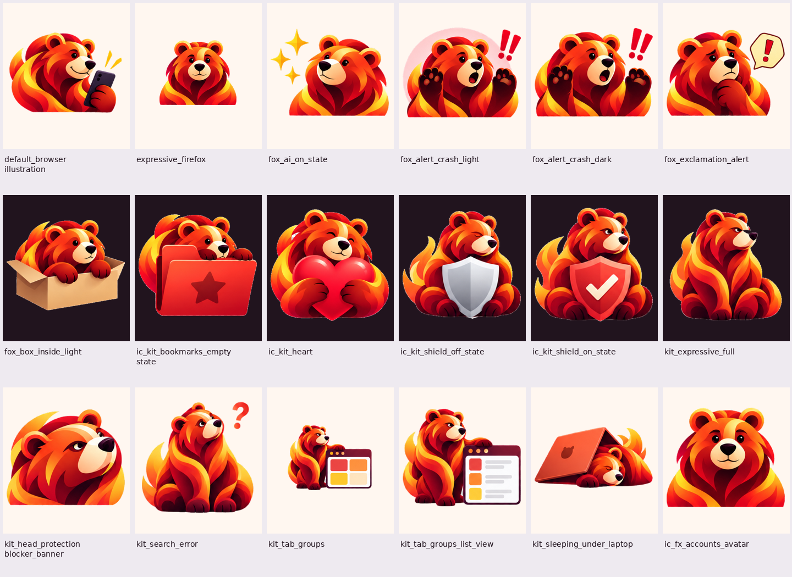
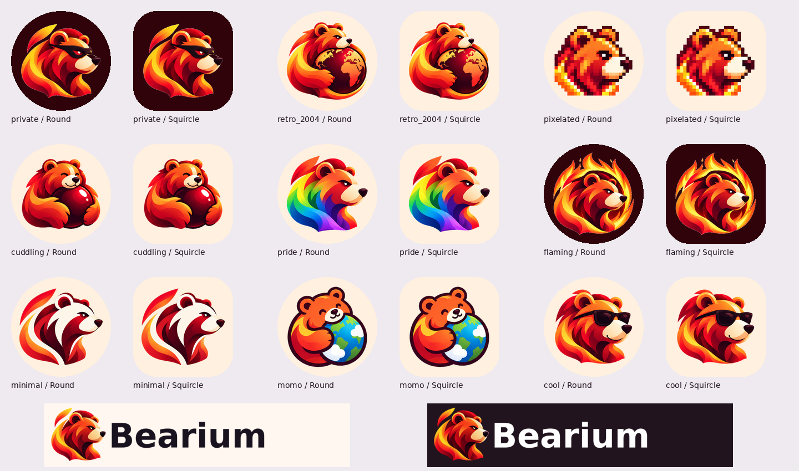

# Иллюстрации Bearium

Комплект по макетам, согласованным 13 сентября 2026 года. Основная иконка
остаётся прежней; остальные лисы заменены красно-оранжевым медведем в её стиле.

Готовые Android-ресурсы находятся в `res/`, отдельные рисунки с альфа-каналом —
в `../source/ui/`. Рисунки подготовлены через imagegen по согласованным листам,
затем отделены от фона и экспортированы в WebP без потерь. Это растровые
иллюстрации, а не SVG, переименованные в векторные ресурсы.

| Ресурс Firefox | Рисунок Bearium |
|---|---|
| `firefox_as_default_banner_illustration` | Медведь с телефоном |
| `expressive_firefox` | Приветствие |
| `fox_ai_on_state` | Медведь с искрами |
| `fox_alert_crash_light`, `fox_alert_crash_dark` | Сбой, два варианта |
| `fox_exclamation_alert` | Предупреждение |
| `illustration_fox_box_inside_light` | Медведь в коробке |
| `ic_kit_bookmarks_empty_state` | Папка закладок |
| `ic_kit_heart` | Сердце |
| `ic_kit_shield_off_state`, `ic_kit_shield_on_state` | Серый щит / красный щит с галочкой |
| `kit_expressive_full` | Сидящий медведь |
| `kit_head_protection_blocker_banner` | Голова медведя |
| `kit_search_error` | Ошибка поиска |
| `mozac_ic_kit_tab_groups`, `mozac_ic_kit_tab_groups_list_view` | Группы вкладок: сетка и список |
| `kit_sleeping_under_laptop` | Медведь под ноутбуком |
| `ic_fx_accounts_avatar`, `ic_onboarding_welcome` | Приветствие |
| `ic_firefox`, `ic_splash_logo`, `ic_wordmark_logo` | Основной знак Bearium |
| `ic_status_logo` | Существующий векторный монохром, размер 24dp |
| `ic_wordmark_text_*`, `ic_logo_wordmark_*` | Название Bearium; светлый и тёмный текст |
| `ic_launcher_private_foreground` | Медведь с маской |
| `ic_retro_2004`, `ic_pixelated`, `ic_cuddling`, `ic_pride` | Соответствующие альтернативные иконки |
| `ic_flaming`, `ic_minimal`, `ic_momo`, `ic_cool` | Соответствующие альтернативные иконки |
| `ic_launcher_foreground_*` | Те же альтернативы с отступами для Android launcher |
| `mozac_ic_kit_tab_groups_animation` | Тот же медведь с вкладками и лёгкой пульсацией масштаба |

## Подключение

`rebrand_resources()` в `scripts/patch_firefox.py` устанавливает комплект в
`main` и `release`. Перед установкой удаляются прежние варианты **тех же имён**
во всех density/night/anydpi/nodpi каталогах: иначе более специфичный вариант
мог бы вернуть старую лису или надпись Firefox. Названия ресурсов оставлены
для совместимости с вызывающим кодом. Каталоги `beta`, `nightly` и `debug` не редактируются.

Иллюстрации, ранее бывшие VectorDrawable, экспортированы в `drawable-xxxhdpi`
с исходным размером viewport в dp. Рисунок вписан без растягивания. Для
Compose используются прямые WebP, не XML `<bitmap>` или `<inset>`.
Ночной wordmark тоже является прямым WebP. Статусный монохром остаётся вектором.

У новых адаптивных foreground размер холста 108dp. Фактический силуэт вписан
в круг диаметром 64dp; фон отделён от рисунка. Приватная адаптивная иконка также
получает monochrome. Основной launcher и его пять density-вариантов экспортирует
существующий `export_branding.py`.

Анимация групп вкладок использует встроенный PNG того же рисунка, без загрузки
из сети. Статичный вариант остаётся для режима с отключёнными анимациями.
Цветовые варианты фонов иконок и иллюстрация `ic_high_five` без лисы сохранены.

## Повторный экспорт

```sh
python -m pip install Pillow
python scripts/export_ui_branding.py
python -m unittest tests.test_patch_firefox tests.test_ui_branding -v
```

Pillow нужен только для экспорта. При сборке APK готовые файлы копируются
стандартной библиотекой Python; генерация изображений не запускается.

Для надписи использован небольшой subset DejaVu Sans Bold только с буквами
слова Bearium. Лицензия шрифта лежит рядом в `../source/DejaVu-LICENSE.txt`.
Исходные рисунки и их экспорт хранятся в репозитории, поэтому повторный
экспорт не зависит от истории чата.

## Превью готовых ресурсов




